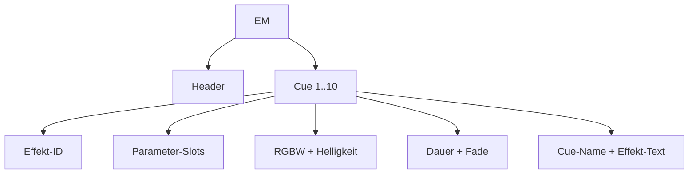
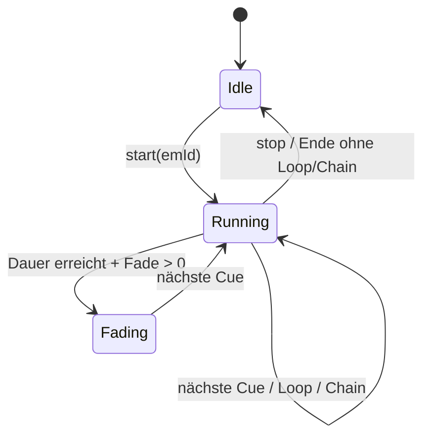
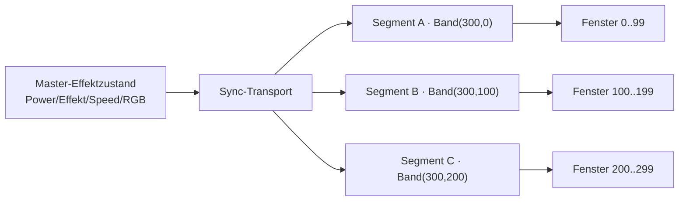
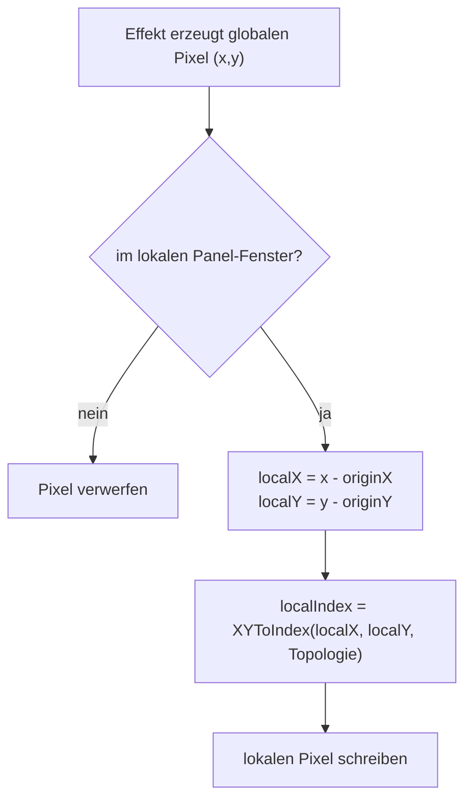

# Effektmanager, Cue & Effektkette — Engine-Architektur

Laufzeit-Architektur der EM-/Cue-/Effektkette-Engine in OFM-NeoPixel. Rein die
Engine-Sicht (Datenmodell, Ablauf, Rendering). Die Ansteuerung von außen (Start/Stop,
Sync-Transport, Konfiguration) liefert die jeweilige Anwendung — die ist hier bewusst
nicht Thema.

## Begriffe
- **Effektmanager (EM):** Sequencer mit einem Header und bis zu 10 Cues.
- **Cue:** Effekt-Snapshot — Effekt-ID, Parameter-Slots, Farbe, Helligkeit, Dauer, Fade, Text.
- **Effektkette:** Geräteübergreifende Segment-Synchronisation; ein Segment ist Master,
  weitere sind Slaves (Sync über einen Transport, den die Anwendung bereitstellt).

## Datenmodell (Engine-Sicht)
Pro EM: ein Header + bis zu 10 Cues (`EffektManagerData` / `EffektCue` in `EffektManager.h`).

Cue-Felder (`EffektCue`, 48 B):
- Effekt-ID (1 B)
- Parameter-Slots (`EM_PARAM_COUNT` = 10 generische Bytes, vom Effekt typabhängig interpretiert)
- Primärfarbe RGB + W (4 B)
- Helligkeit (1 B)
- Dauer (Sekunden, 0 = unbegrenzt halten)
- Fade/Übergang (ms, 0 = harter Schnitt)
- Cue-Name (14 B) — Anzeige-/ETS-Name der Cue
- Effekt-Text (14 B) — für Text-Effekte (z.B. Scrolltext)

## EM-Laufzeit (EffektManagerController)

Ablauf:
1. `start(emId)` setzt die aktive EM-ID und wendet sofort Cue 1 an.
2. Jeder `tick()` prüft Dauer- und Fade-Zustand der aktiven Cue.
3. Dauer = 0 bedeutet „unbegrenzt halten" (kein Auto-Weiterschalten).
4. Am Cue-Ende: nächste Cue, oder Loop ab Cue 1, oder Chain auf den nächsten EM.
5. `stop()` löscht den Laufzeit-Zustand und die Effekt-Ausgabe des Segments.

Bounds: Ein stale/zu großer Cue-Index wird auf 0 zurückgesetzt (`activeCueIdx >= cueCount`),
`cueCount <= EM_CUE_COUNT`. `tick()` läuft nur bei `isRunning()` (aktive EM-ID != none).

## Cue anwenden (`applyCue`)
1. Primärfarbe (RGBW) setzen.
2. Helligkeit setzen.
3. Effekt per Effekt-ID auflösen (`EffectPool::getEffectByIndex`, null-geprüft); unbekannte/0-ID
   → Effekt löschen + Segment leeren.
4. Effekt-Parameter aus den Cue-Slots schreiben (begrenzt auf `getParameterCount()` und
   `EM_PARAM_COUNT`); jeder Wert wird auf Min/Max geklemmt, Unter-Min fällt auf den Effekt-Default.
5. Sonderfall: bei String-/Text-Parametern den `effectText` der Cue statt des numerischen Slots setzen.

## Effektkette (Master/Slave)
Rollen: `syncMode = 1` Master (sendet Sync), `2` Slave (wendet Sync an), `0` aus.

Aktueller Sync-Payload (Basis-Zustand, 6 B): Power-Flag, Effekt-ID, Speed, RGB.
Nicht im Payload: W-Kanal, Helligkeit, effekt-spezifische Parameter.

**Lokales Offset-Eigentum:** Jeder Slave hält sein eigenes virtuelles Band-Fenster
(`setVirtualBand(totalLength, offset)` am Segment). Der Master sendet **keine** Per-Slave-Offsets —
der Master sitzt per Definition bei Offset 0 (Bandanfang), die Slaves kennen ihren eigenen Offset.

Slave-Verhalten: Effekt-ID + Speed + RGB übernehmen, `lastSyncMs` aktualisieren; ein
Watchdog schaltet das Segment nach Timeout ab.

## Prioritäten
- Startet ein EM, pausiert er das virtuelle-Band-Verhalten des Segments; `stop()` stellt es wieder her.
- Direkte Segment-Schreibzugriffe können die EM-Ausgabe je nach Loop-Timing optisch übersteuern
  (zuletzt geschrieben gewinnt).

## Verteiltes 2D (Zielkonzept — noch nicht umgesetzt)
Für ein durchgehendes Matrix-Bild über mehrere Geräte sollten Effekte in einem **globalen
2D-Raum** rendern; jeder Slave clippt auf sein lokales Panel-Fenster.

Konfigurations-Felder (Engine-Sicht): Modus (aus / linear / verteilt-2D), globale
Matrixbreite/-höhe, Panel-Ursprung X/Y, Panel-Breite/-Höhe, lokale Topologie.

Koordinaten-Regeln bei globalem `(x,y)`:
1. Fenster-Test: `originX <= x < originX+panelWidth`, `originY <= y < originY+panelHeight`.
2. Lokale Koordinaten: `localX = x - originX`, `localY = y - originY`.
3. Lokale Index-Umrechnung über die lokale Topologie (Reihen/Spalten, linear/Schlange).

Beispiel (Scrolltext über 3 Panels): logische Matrix `96x8`, drei Panels `32x8` mit
Ursprüngen X = 0 / 32 / 64. Der Effekt rechnet global (`x = 0..95`), jedes Gerät zeigt nur
sein Fenster → Übergänge bei x=31/32 und x=63/64 bleiben nahtlos.

## Bekannte Grenzen
1. Cue-Parameter aktuell auf eine feste Slot-Anzahl begrenzt (Effekte mit mehr Parametern
   werden in Cues entsprechend gekappt).
2. Effektkette synchronisiert nur den Basis-Zustand (Power, Effekt, Speed, RGB).
3. Override-Policy ist vorbereitet, das lokale Override-Flag wird im Laufzeitfluss aktuell
   nicht aktiv gesetzt.
4. Verteiltes 2D über die Effektkette ist noch nicht vollständig modelliert: 2D-Effekte
   schreiben lokale XY-Indizes, während die Band-Offset-Übersetzung globale lineare Indizes
   erwartet — 2D + Slave-Offset ≠ 0 ist daher noch kein verlässlicher geräteübergreifender
   Matrix-Modus.

## Nächste Schritte
1. Cue-Parametermodell modernisieren (mehr Parameter, klare Typen, explizite Versionierung).
2. Effektkette-Payload optional um Helligkeit, W und Parameter-Profil erweitern.
3. Override-Policy fertig implementieren (localOverride bei lokalen Aktionen setzen/zurücksetzen).
4. Verteiltes 2D umsetzen (globaler Render-Raum + Slave-Clipping).
